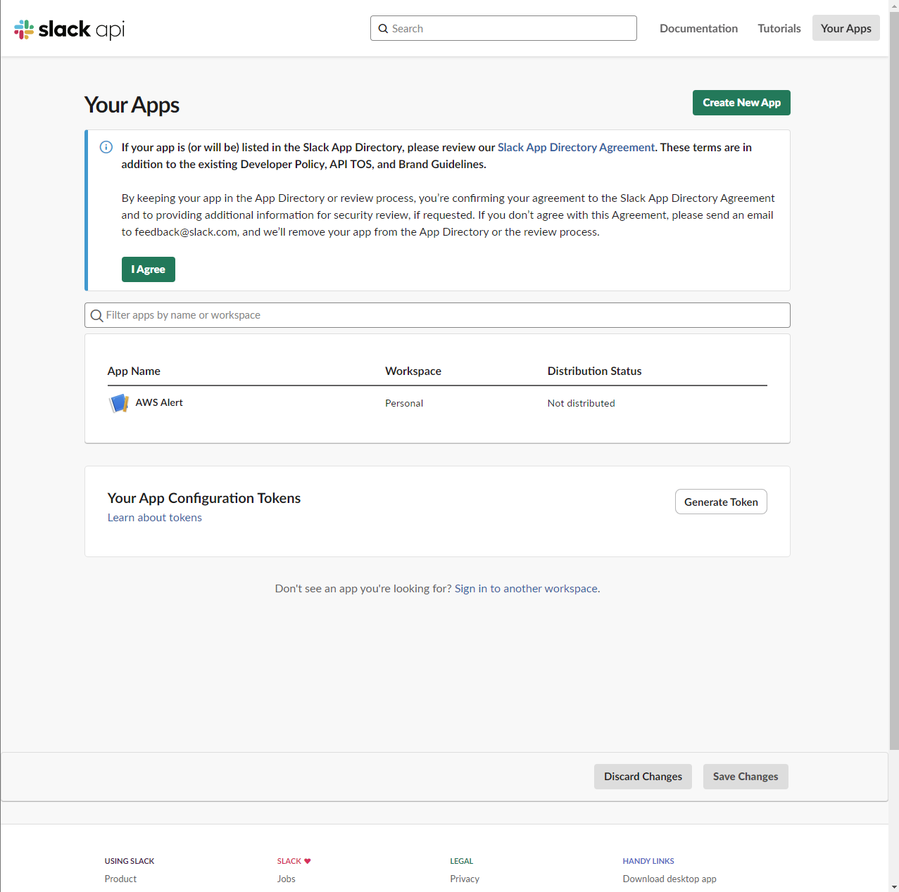
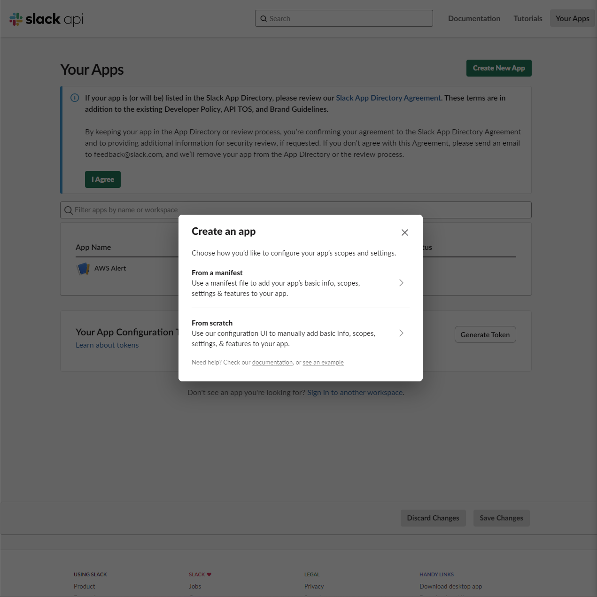
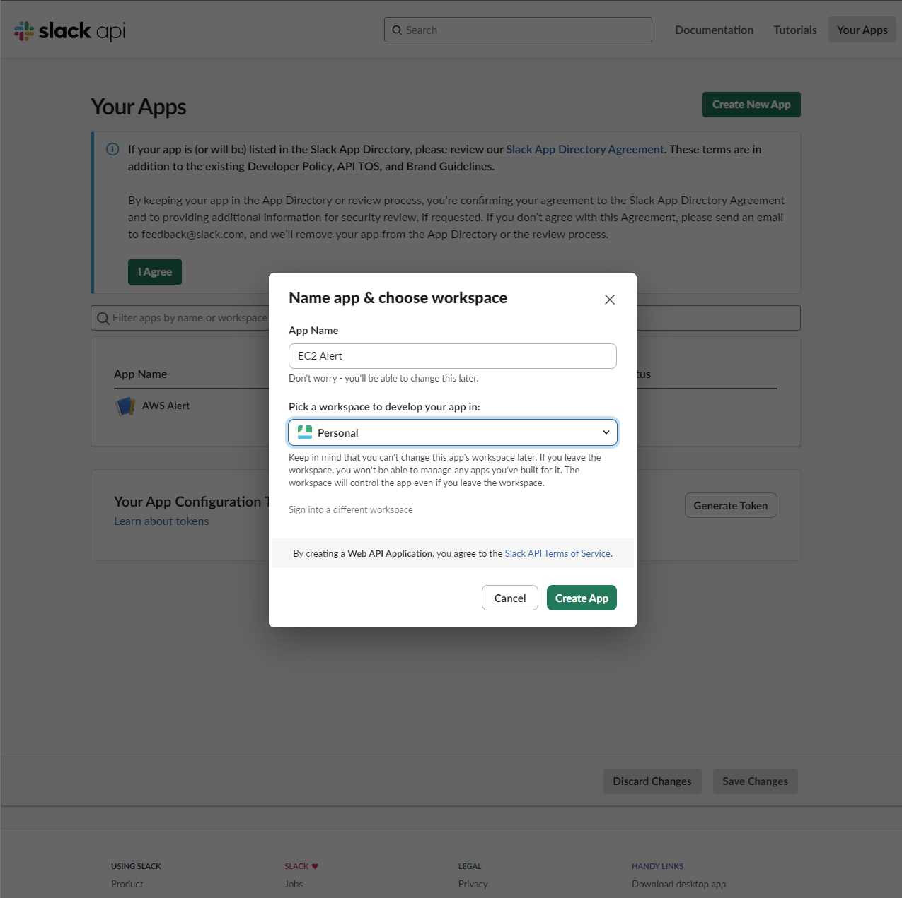
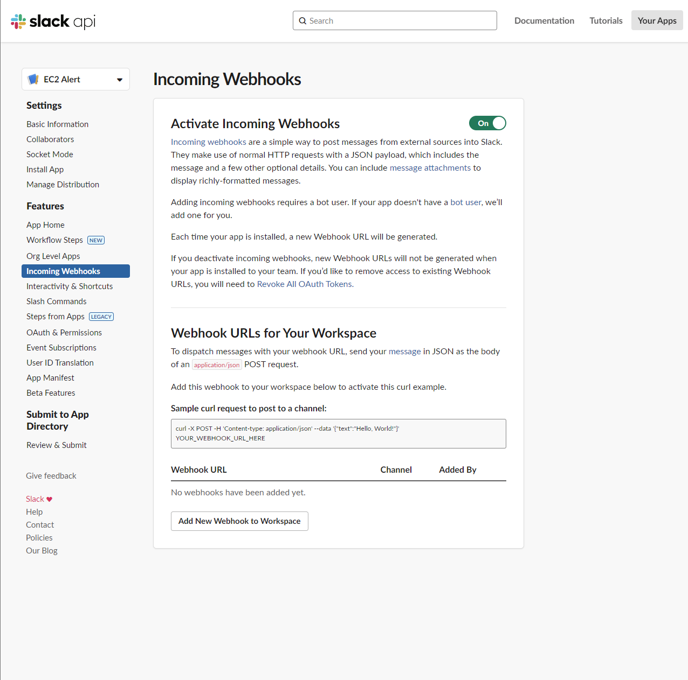
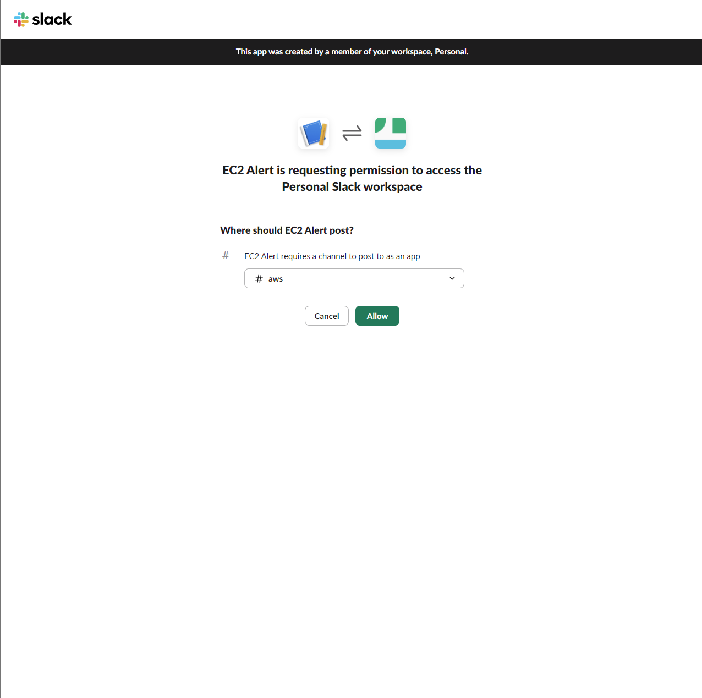
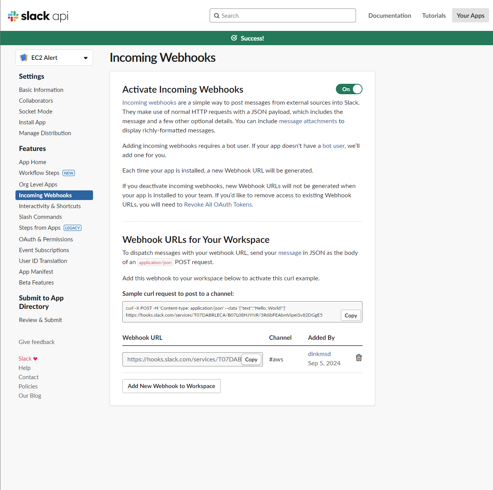

+++
title = "Get slack webhook link"
date = 2024
weight = 3
chapter = false
pre = "<b>3. </b>"
+++

1. Create new App
   
   
   
2. Active Incoming Webhooks
   
3. Select Slack Channel to notify
   
4. Get webhook link
   
