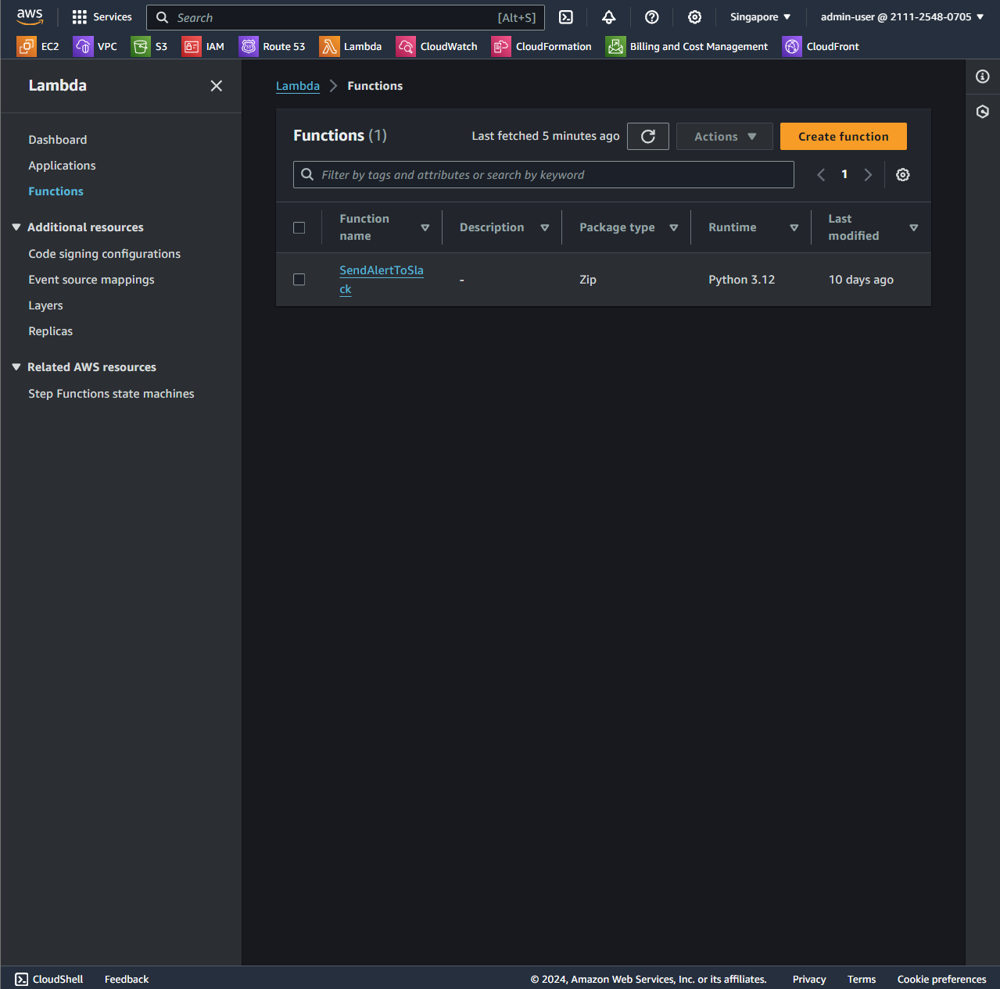
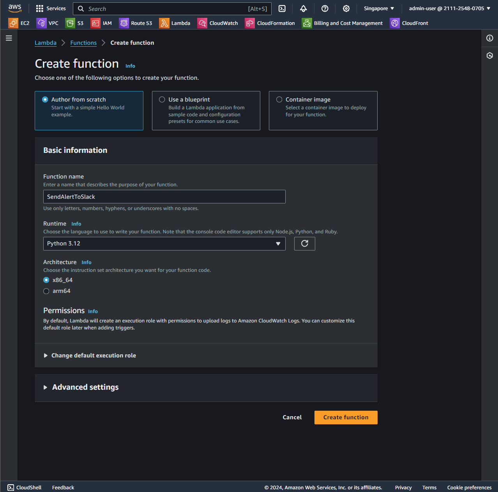
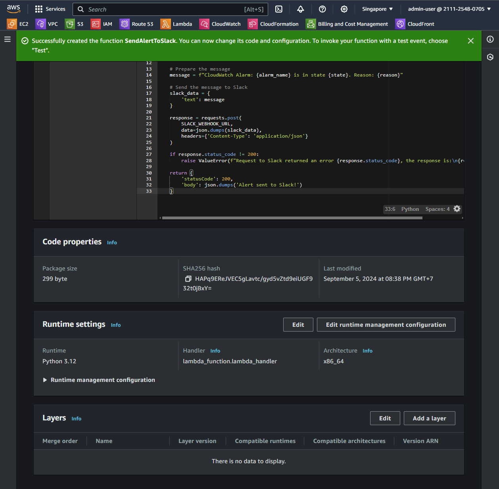
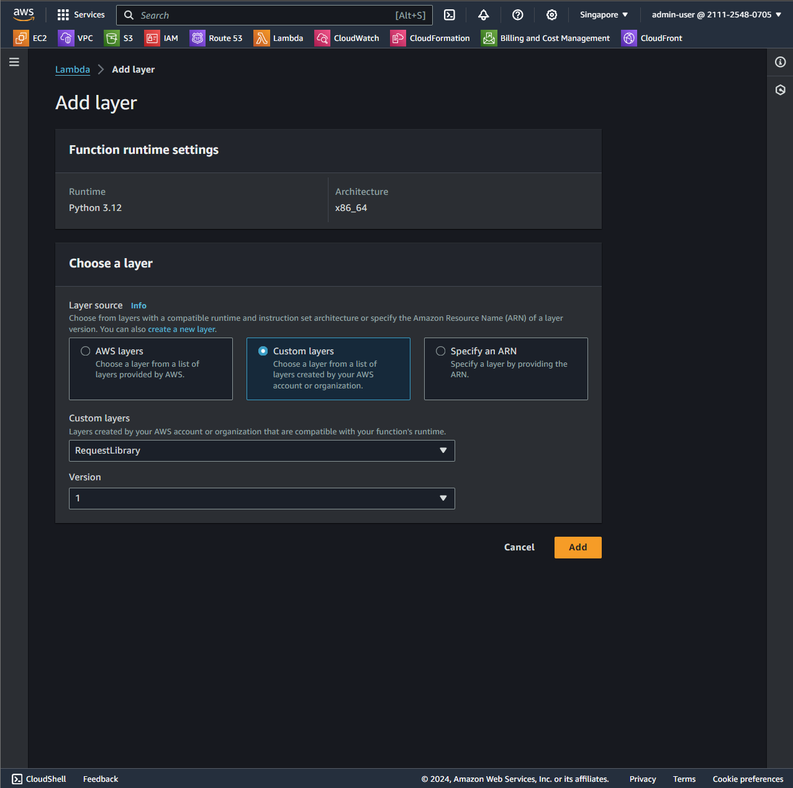
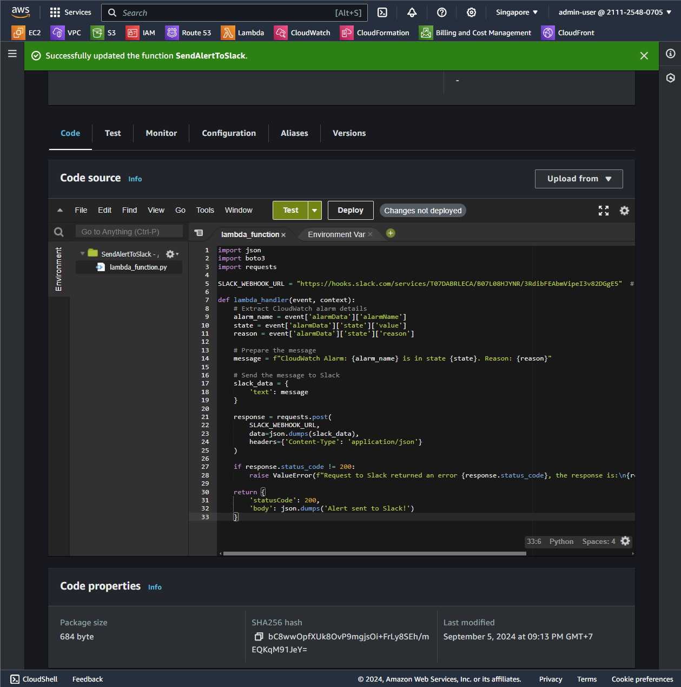

1. Create new function
   
2. Fill bellow infomation
   
3. Add library
   
   
4. Add follow code to send alert to slack
   

```
import json
import boto3
import requests

SLACK_WEBHOOK_URL = "https://hooks.slack.com/services/YOUR/SLACK/WEBHOOK"  # Replace with your Slack Webhook URL

def lambda_handler(event, context):
    # Extract CloudWatch alarm details
    alarm_name = event['alarmData']['alarmName']
    state = event['alarmData']['state']['value']
    reason = event['alarmData']['state']['reason']

    # Prepare the message
    message = f"CloudWatch Alarm: {alarm_name} is in state {state}. Reason: {reason}"

    # Send the message to Slack
    slack_data = {
        'text': message
    }

    response = requests.post(
        SLACK_WEBHOOK_URL,
        data=json.dumps(slack_data),
        headers={'Content-Type': 'application/json'}
    )

    if response.status_code != 200:
        raise ValueError(f"Request to Slack returned an error {response.status_code}, the response is:\n{response.text}")

    return {
        'statusCode': 200,
        'body': json.dumps('Alert sent to Slack!')
    }
```
