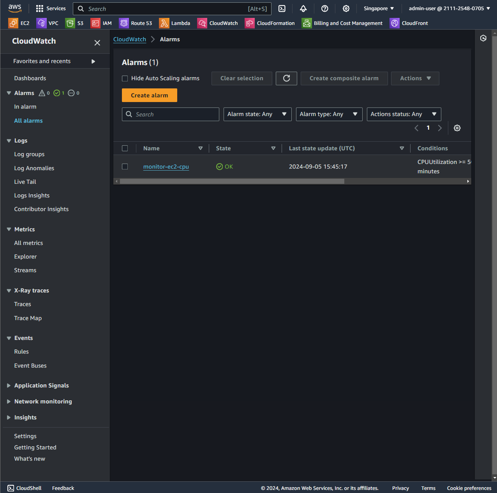
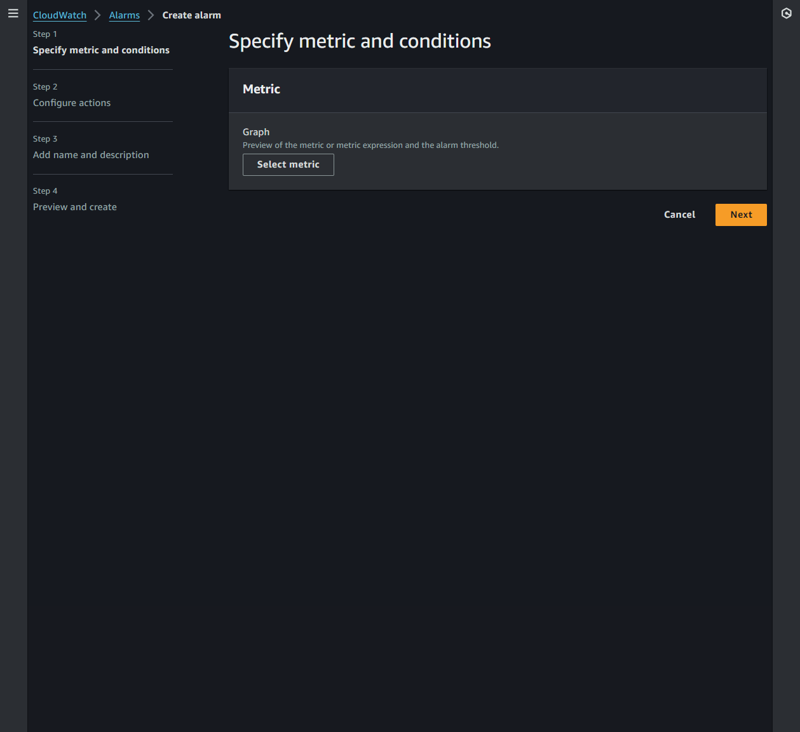
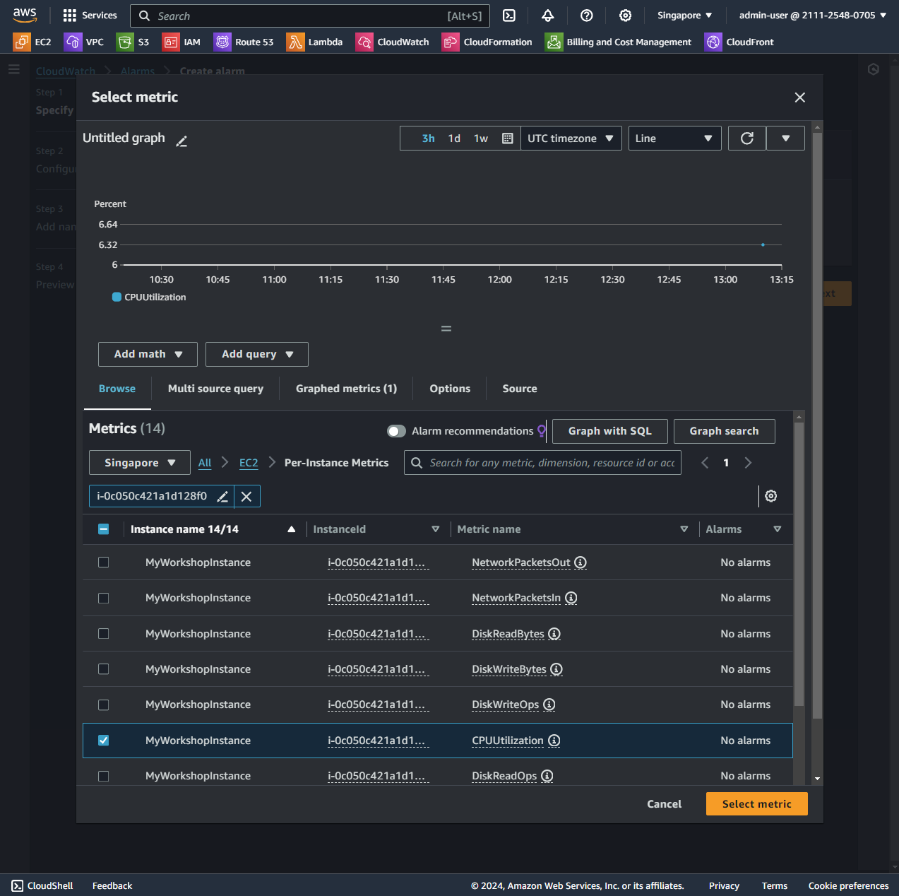
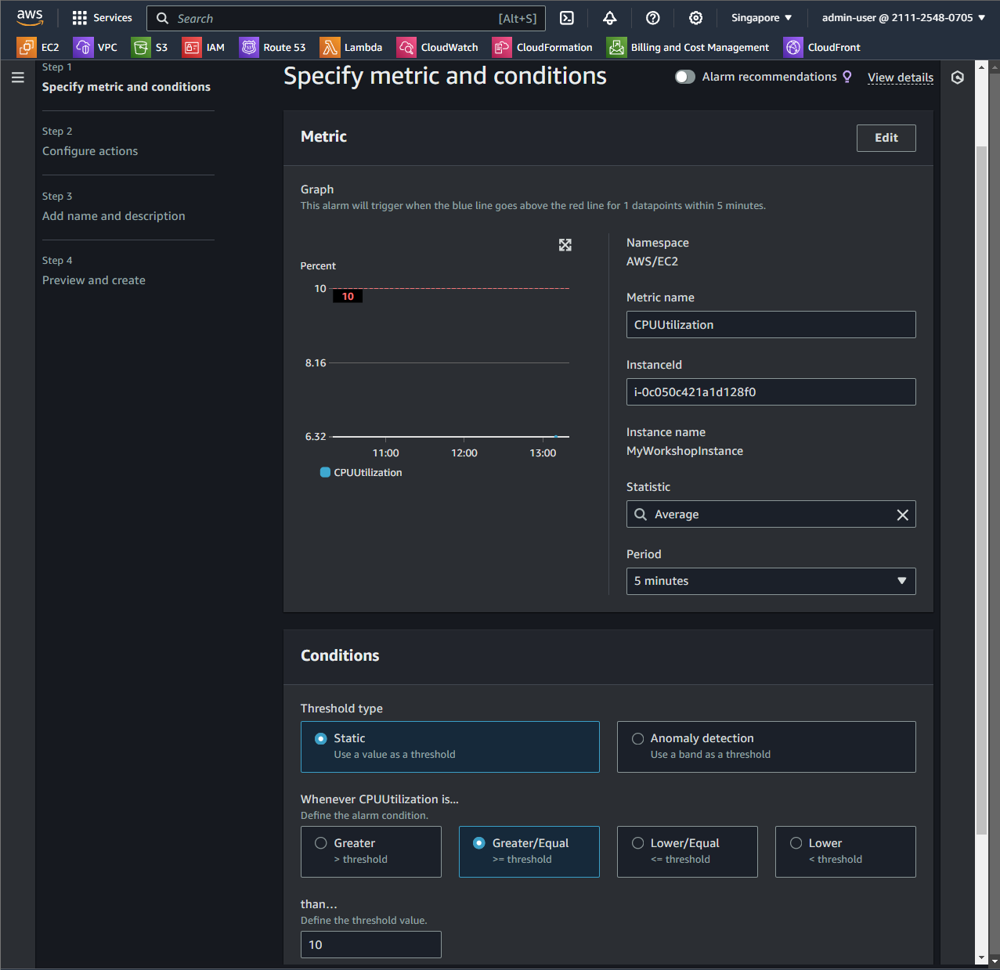
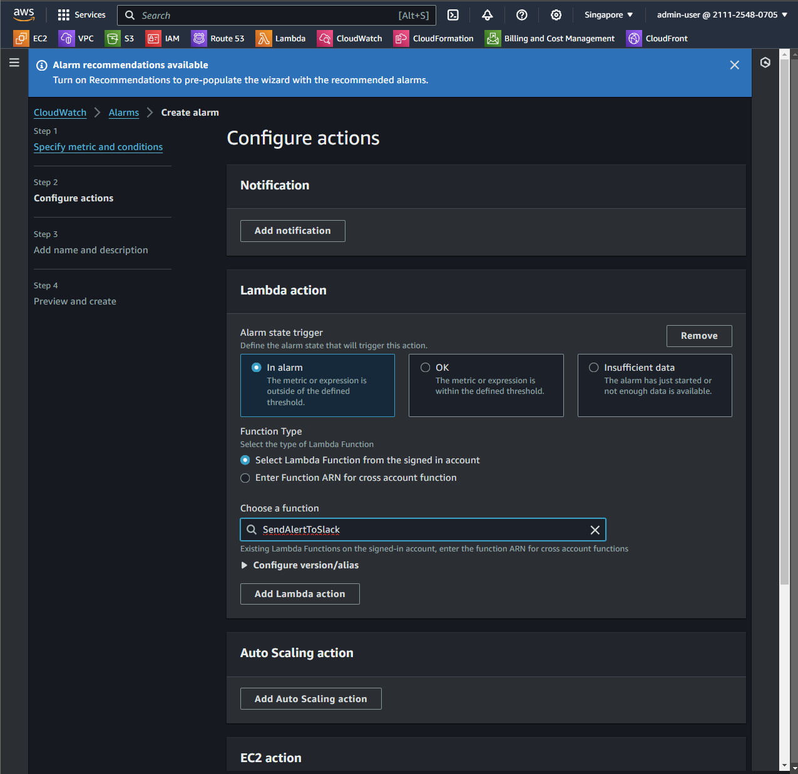
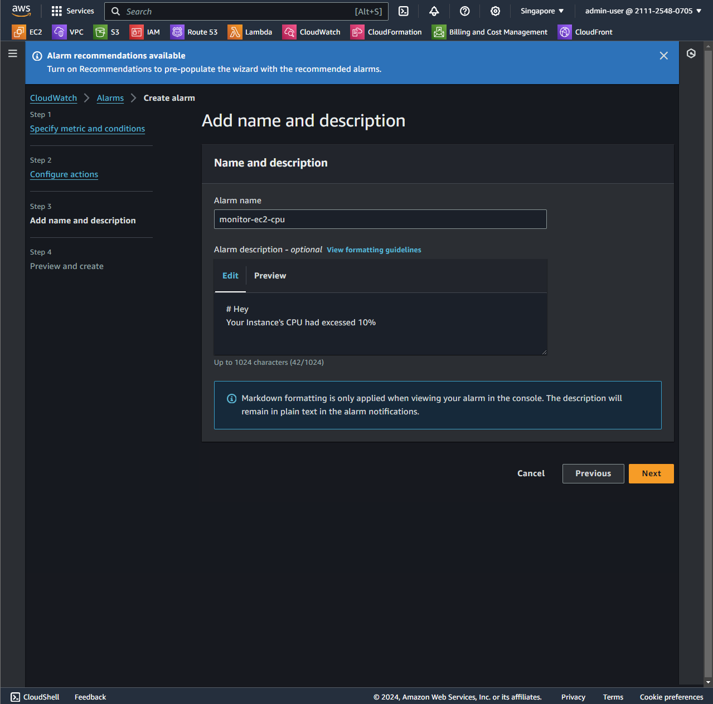
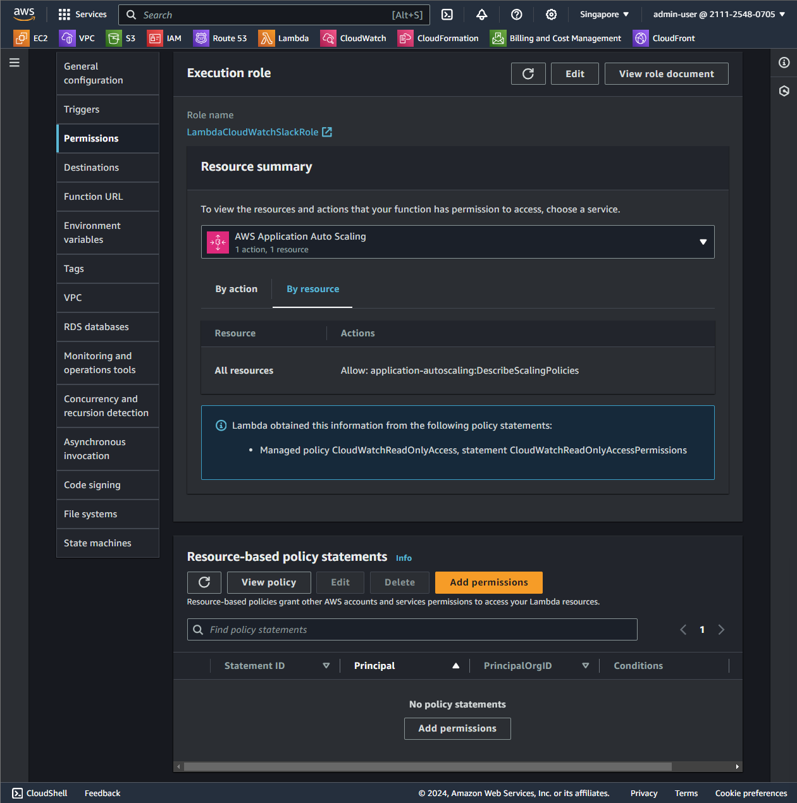
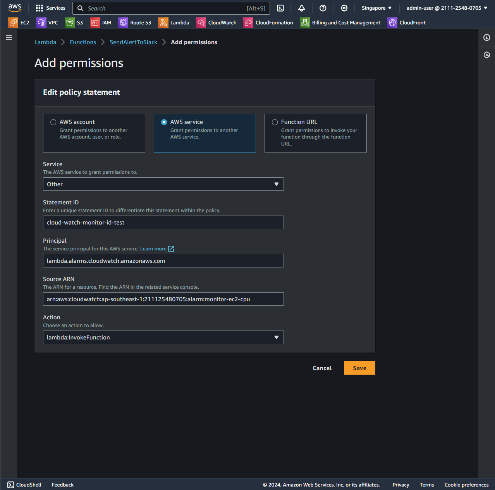

In this step, we will create CloudWatch service to Monitor EC2 CPU.

1. Select Service CloudWatch
   
2. Create Alarm
   
3. Choose metric is EC2 was created and metric named `CPUUtilization`
     
   
4. Setup param
   
5. Add lambda function
   
6. Enter name and create alarm
   
7. Assign lambda trigger permission for alarm
   
8. Fill bellow infomation
   
