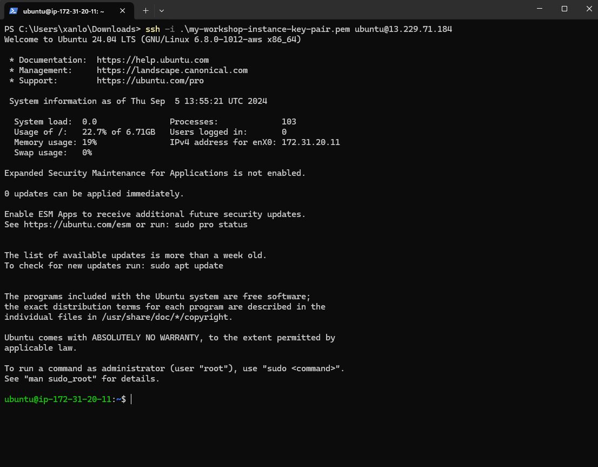
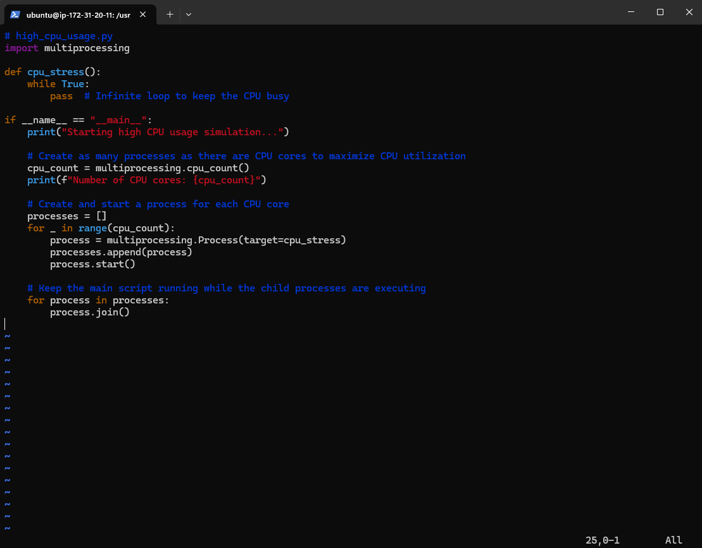
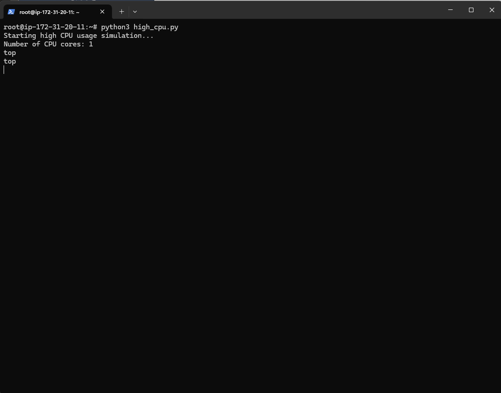
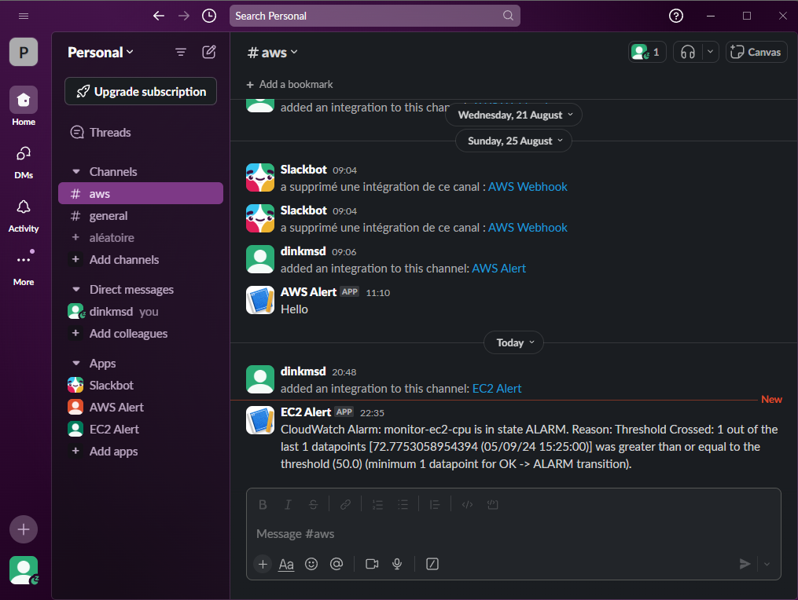

+++
title = "Test"
date = 2022
weight = 6
chapter = false
pre = "<b>6. </b>"
+++

1. SSH to EC2 instance
   
2. Create python script to virtual high CPU
   

```
# high_cpu_usage.py
import multiprocessing

def cpu_stress():
    while True:
        pass  # Infinite loop to keep the CPU busy

if __name__ == "__main__":
    print("Starting high CPU usage simulation...")

    # Create as many processes as there are CPU cores to maximize CPU utilization
    cpu_count = multiprocessing.cpu_count()
    print(f"Number of CPU cores: {cpu_count}")

    # Create and start a process for each CPU core
    processes = []
    for _ in range(cpu_count):
        process = multiprocessing.Process(target=cpu_stress)
        processes.append(process)
        process.start()

    # Keep the main script running while the child processes are executing
    for process in processes:
        process.join()
```

4. Run script
    5. Result:
   
