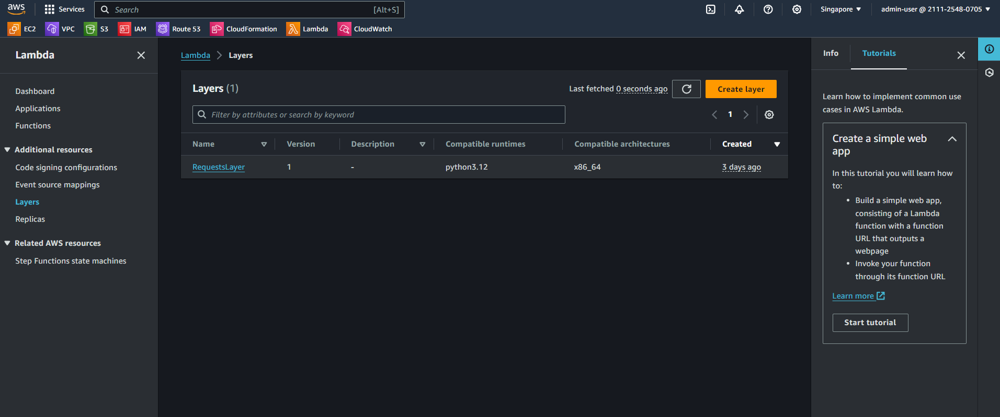
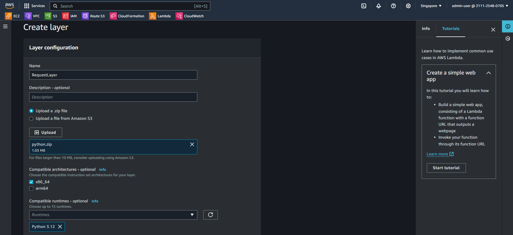

## Use python library

1. To install library to use on lambda function, you need use Layers feature to upload library which get from Ubuntu environment and ziped, if don't have more time to get this, download [here](/00001-SlackAlertEC2/data/python.zip)
2. Select Layer -> Create Layer
   
3. Fill bellow info to create layer
   
