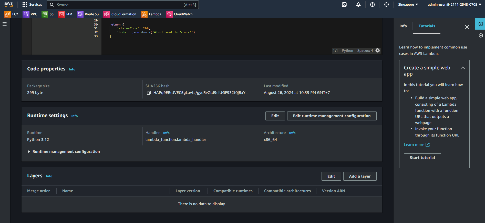
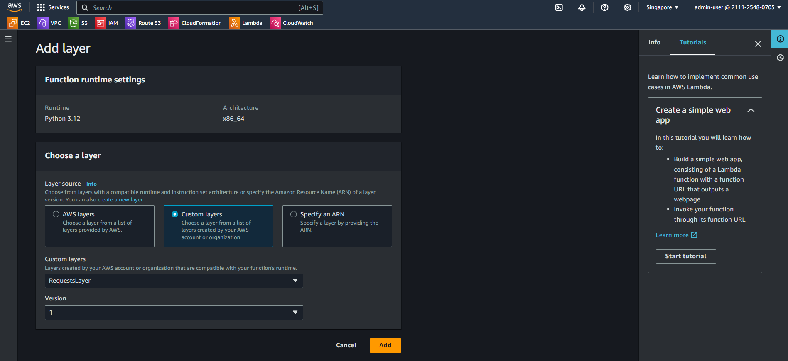

## Create a Lambda function

1. Create a New Lambda Function:

- Go to the AWS Lambda service.
- Click on "Create function."
- Choose "Author from scratch."
- Name your function (e.g., `SendAlertToSlack`).
- Choose the runtime (e.g., Python 3.9).
- Select the `LambdaCloudWatchSlackRole` for permission you created earlier.
- Click "Create function."

2. Add Code to Send Alerts to Slack:

- Replace the default code in the Lambda function with the following Python code:

```
import json
import boto3
import requests

SLACK_WEBHOOK_URL = "https://hooks.slack.com/services/YOUR/SLACK/WEBHOOK"  # Replace with your Slack Webhook URL

def lambda_handler(event, context):
    # Extract CloudWatch alarm details
    alarm_name = event['detail']['alarmName']
    state = event['detail']['state']['value']
    reason = event['detail']['state']['reason']

    # Prepare the message
    message = f"CloudWatch Alarm: {alarm_name} is in state {state}. Reason: {reason}"

    # Send the message to Slack
    slack_data = {
        'text': message
    }

    response = requests.post(
        SLACK_WEBHOOK_URL,
        data=json.dumps(slack_data),
        headers={'Content-Type': 'application/json'}
    )

    if response.status_code != 200:
        raise ValueError(f"Request to Slack returned an error {response.status_code}, the response is:\n{response.text}")

    return {
        'statusCode': 200,
        'body': json.dumps('Alert sent to Slack!')
    }
```

- Replace `SLACK_WEBHOOK_URL` with your actual Slack webhook URL.
- Click "Deploy" to save the function.

3. Add layer
   
   
4. Config permission:

- Configuration -> Permissions -> Resource-based policy statements -> Add permissions
- Choose `AWS service` -> Service `Other` -> Statement ID `custom-permission` -> Pricipal `lambda.alarms.cloudwatch.amazonaws.com` -> Action `lambda:InvokeFunction` -> Save
  
